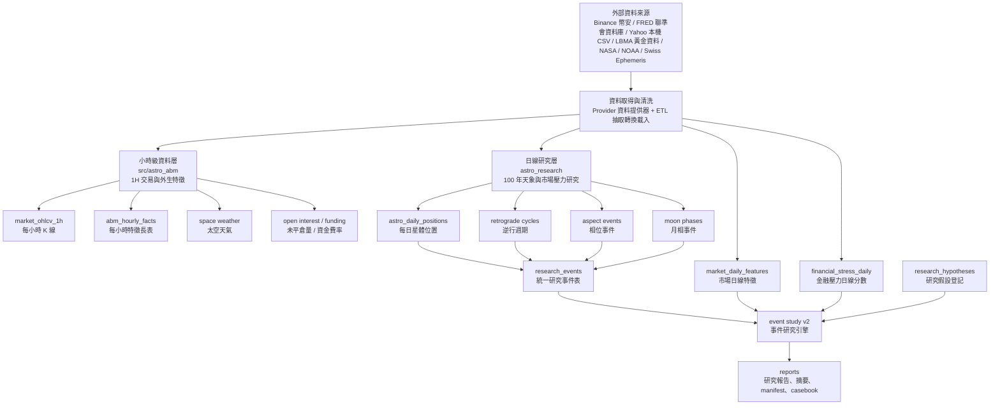

# Astro ABM 項目維護者簡報

日期：2026-05-19
目前主線：`main`
目前研究定位：描述性歷史關聯研究，不是交易系統。

這份文件是給維護者快速接手用的中文簡報。文件會保留必要英文欄位或檔名，因為程式碼、資料表、報告仍使用英文命名；但每個重要英文詞會盡量附中文註釋，方便往後維護。

## 投影片 1：一句話定位

Astro ABM 目前不是「自動交易模型」，也還不是完整的 `agent-based simulator`（基於代理人的模擬器）。

它現在是一套「資料工程 + 研究輸出」系統，用來檢查：

> 可客觀計算的天象事件、太空天氣事件，是否在歷史上經常與金融市場壓力、市場波動、重大危機窗口同時出現。

可說：

- historical association：歷史關聯
- descriptive overlap：描述性重疊
- stress-regime exploration：壓力狀態探索
- event-study review：事件研究審查

不可說：

- causality：因果
- prediction：確定預測
- trading signal：交易訊號
- investment advice：投資建議

## 投影片 2：整個項目的兩條主線

這個 repo 分成兩層，不要混在一起理解。

| 層級 | 英文名稱 | 中文理解 | 主要粒度 | 目前用途 |
|---|---|---|---|---|
| 小時級資料管線 | hourly pipeline | 每小時維護市場、衍生品、太空天氣與天體資料 | 1H | 為未來 ABM / ML / 回測提供乾淨 feature store |
| 日線研究層 | daily research layer | 100 年日線天象與金融壓力研究 | 1D | 研究天象事件窗口與市場壓力的歷史關聯 |

簡單記法：

- `src/astro_abm/`：小時級資料工程主系統。
- `astro_research/`：日線級 100 年研究主系統。

## 投影片 3：資料流總覽



## 投影片 4：目前已完成的里程碑

| 區塊 | 狀態 | 中文理解 |
|---|---|---|
| QuestDB | 已完成 | 本機時間序列資料庫，用來存市場與研究資料 |
| Docker / OrbStack runtime | 已完成 | 本機容器運行環境，可自動跑維護服務 |
| Hourly market data | 已完成主要骨架 | 小時級市場 K 線與特徵 |
| Binance Vision metrics | 已接入 | 幣安公開歷史衍生品指標，例如未平倉量 |
| Space weather | 已接入 | 太陽風、IMF Bz、Kp、X-ray 等太空天氣 |
| Astro daily layer | 已完成 | 1926-2025 日線星體位置、逆行、月相、相位 |
| Aspect chunk build | 已完成 | 把 100 年相位計算分年、分星體組合執行，避免一次太重 |
| Market / macro daily layer | 已完成骨架 | 日線市場與宏觀資料 |
| Financial stress daily | 已完成 | 跨資產金融壓力分數 |
| Research events | 已完成 MVP5.5 | 把 station、aspect、moon phase 等統一成研究事件 |
| Hypothesis registry | 已完成 | 所有正式研究都要先登記假設 |
| Exploratory formal batch | 已跑通 | H001-H004 探索性正式批次研究 |
| Crisis casebook | 已完成初版 | 重大危機個案索引與報告 |
| Research workflow checkpoint | 已完成 | 一條命令重建研究輸出並檢查邊界 |

## 投影片 5：repo 目錄地圖

```text
astro-abm/
├── src/astro_abm/
│   ├── etl/                      # ETL：資料抽取、轉換、載入、定時維護
│   ├── market_data/              # 市場資料 provider：幣安、CCData、衍生品等
│   ├── features/                 # 特徵計算：天體、太空天氣、價格行為、regime
│   ├── analysis/                 # 分析工具：完整性、訓練資料、風險日曆
│   └── storage/                  # QuestDB 連線與寫入
│
├── astro_research/
│   ├── configs/                  # 研究配置 YAML
│   ├── migrations/               # QuestDB 研究層資料表 schema
│   ├── src/astro_daily/          # 天象日線生成
│   ├── src/market_daily/         # 市場日線資料與特徵
│   ├── src/research/             # 研究事件、壓力分數、事件研究、報告
│   ├── tests/                    # 研究層測試
│   ├── data/local/               # 本機長歷史 CSV，已 git ignore
│   └── output/                   # 生成報告與 Parquet，已 git ignore
│
├── scripts/                      # 可直接執行的命令腳本
├── sql/                          # 小時級 QuestDB schema
├── docs/research/                # 中文研究筆記與維護簡報
└── docker-compose.questdb.yml    # QuestDB 與維護服務容器配置
```

## 投影片 6：最重要的配置文件

| 路徑 | 中文用途 |
|---|---|
| `astro_research/configs/astro_daily.yaml` | 100 年日線天象資料生成設定 |
| `astro_research/configs/market_assets_real.yaml` | 真實市場資產資料來源設定 |
| `astro_research/configs/macro_series.yaml` | 宏觀資料序列設定，例如 VIX、利率、信用利差 |
| `astro_research/configs/financial_stress.yaml` | 金融壓力分數設定 |
| `astro_research/configs/research_events.yaml` | 把天象輸出整理成統一研究事件 |
| `astro_research/configs/research_hypotheses.yaml` | 研究假設登記 |
| `astro_research/configs/research_batch_exploratory_v1.yaml` | H001-H004 探索性研究批次設定 |
| `astro_research/configs/crisis_casebook.yaml` | 重大危機個案報告設定 |

## 投影片 7：小時級資料表怎麼看

| table 表名 | 中文理解 | 維護者要知道什麼 |
|---|---|---|
| `market_ohlcv_1h` | 每小時市場 K 線表 | 存 open/high/low/close/volume，也就是開高低收與成交量 |
| `abm_hourly_facts` | 每小時特徵長表 | 適合存太空天氣、天體、衍生品等 flexible metrics |
| `etl_runs` | 資料任務執行紀錄 | 看每次 backfill / maintain 是否成功 |
| `v_space_weather_unified` | 太空天氣統一視圖 | NASA authoritative 優先，NOAA provisional 補近端缺口 |
| `v_open_interest_unified` | 未平倉量統一視圖 | 統一 Binance futures / Binance Vision 等 OI 來源 |

## 投影片 8：日線研究資料表怎麼看

| table 表名 | 中文理解 | 維護者要知道什麼 |
|---|---|---|
| `astro_daily_positions` | 每日星體位置 | 每個星體每天的黃經、速度、赤緯、是否逆行 |
| `astro_retrograde_cycles` | 逆行週期 | direct-to-retrograde 與 retrograde-to-direct station 配對 |
| `astro_aspect_events` | 精確相位事件 | 星體形成 conjunction / square / opposition 等相位的精確時間 |
| `astro_moon_phase_events` | 月相事件 | NewMoon / FullMoon 等精確時間 |
| `astro_daily_features` | 每日天象寬表 | 給模型或研究 join 用，一天一列 |
| `research_events` | 統一研究事件 | 把逆行、相位、月相、cluster 都標準化成同一格式 |
| `research_hypotheses` | 研究假設表 | 每個 formal / exploratory 研究都應有 hypothesis_id |
| `financial_stress_daily` | 金融壓力日線表 | 跨股市、波動率、利率、信用、美元、黃金、加密市場的壓力分數 |
| `event_study_results_v2` | 事件研究結果表 | 存 effect、baseline、p-value、q-value、coverage warning |

## 投影片 9：目前 H001-H004 是什麼

| 假設 ID | 英文名稱 | 中文理解 | 目前狀態 |
|---|---|---|---|
| H001 | station cluster stress | 多個星體 station 集中時，市場壓力是否較高 | exploratory，可審查但不是結論 |
| H002 | Mercury station volatility | 水星停滯點附近，市場波動是否較高 | insufficient_sample，樣本或覆蓋不足 |
| H003 | Mars-Saturn hard aspects | 火星-土星硬相位附近，回撤或波動是否較高 | insufficient_sample，但事件已接上 |
| H004 | macro-core aspect cluster | 慢速宏觀星體相位聚集時，跨資產壓力是否較高 | insufficient_sample，但事件已接上 |

最新 exploratory batch 重點：

- `event_study_results_v2`：1080 rows。
- `research_events`：12784 rows。
- `top_findings`：目前沒有通過嚴格門檻的穩健發現。
- `q_value_fdr < 0.10` 的結果：0 rows。

中文解讀：目前系統已能穩定產出研究結果，但還沒有可稱為 robust finding（穩健發現）的統計結果。這是合理且健康的，代表系統沒有亂輸出誇大結論。

## 投影片 10：Crisis casebook 是什麼

`crisis casebook` 可以翻成「危機個案簿」。

它不是統計檢定，而是把重大歷史危機前後窗口整理成可讀報告，用來看：

- 市場壓力是否升高
- 哪些資料缺失
- 當時有哪些天象事件重疊
- 個案是否值得形成下一個研究假設

目前包含 9 個個案：

| crisis | 中文 |
|---|---|
| 1929 Crash / Great Depression | 1929 崩盤 / 大蕭條 |
| 1971 Nixon Shock | 1971 尼克森衝擊 |
| 1973 Oil Crisis | 1973 石油危機 |
| 1987 Black Monday | 1987 黑色星期一 |
| 1997 Asian Financial Crisis | 1997 亞洲金融危機 |
| 2000 Dot-com Crash | 2000 網路泡沫崩盤 |
| 2008 Global Financial Crisis | 2008 全球金融危機 |
| 2020 COVID Crash | 2020 疫情崩盤 |
| 2022 Inflation / Rate Shock | 2022 通膨 / 升息衝擊 |

入口：

```text
astro_research/output/reports/research_workflow_checkpoint/casebook/index.md
```

## 投影片 11：checkpoint 是什麼

`research workflow checkpoint` 可以翻成「研究工作流檢查點」。

它是一條命令，用來重建目前主要研究輸出，並檢查維護邊界。

執行：

```bash
uv run python scripts/research_workflow_checkpoint.py
```

它會依序做：

1. build crisis casebook reports：建立危機個案報告。
2. build crisis casebook index：建立危機個案索引。
3. run H001-H004 exploratory formal batch：跑 H001-H004 探索性研究批次。
4. build research readout summary：建立研究摘要。
5. verify outputs stay under `astro_research/output/`：確認輸出都留在 ignored output 目錄。
6. verify generated outputs, local CSVs, and secrets are not staged：確認生成物、本機 CSV、密鑰沒有進 git staged。
7. verify readout language remains descriptive only：確認報告語言沒有變成因果、預測或交易建議。

只檢查，不重跑：

```bash
uv run python scripts/research_workflow_checkpoint.py --check-only
```

## 投影片 12：run manifest 是什麼

`run manifest` 可以翻成「研究批次清單」或「可重現性清單」。

它通常是 `run_manifest.json`，用來回答：

- 這次研究是哪個 run id？
- 用了哪個 git commit？
- 當時 git 是否 dirty？
- 讀入了多少 input rows？
- 輸出了哪些 artifacts？
- config hash 是什麼？
- 有哪些 warnings？

維護者要判斷一份報告是否可信，先看 manifest。

入口：

```text
astro_research/output/reports/research_workflow_checkpoint/exploratory_batch/run_manifest.json
```

## 投影片 13：常見英文詞彙中文對照

| English | 中文建議翻譯 | 維護者理解 |
|---|---|---|
| ABM / agent-based model | 基於代理人的模型 | 由多個代理人互動形成市場行為的模擬 |
| simulator | 模擬器 | 目前還沒做完整模擬器 |
| pipeline | 管線 | 一串資料處理流程 |
| ETL | 抽取、轉換、載入 | Extract / Transform / Load |
| provider | 資料提供器 | 封裝某個資料來源的讀取邏輯 |
| feature | 特徵 | 可餵給模型或研究的欄位 |
| feature store | 特徵庫 | 存放標準化特徵的資料層 |
| schema | 資料表結構 | 欄位、型別、key 等定義 |
| migration | 資料表遷移 | 建表或更新 schema 的 SQL |
| source registry | 資料來源登記表 | 記錄來源、授權、覆蓋範圍 |
| provenance | 來源血統 / 來源追溯 | 資料從哪裡來、怎麼轉換 |
| coverage | 覆蓋範圍 | 資料從哪天到哪天、缺多少 |
| readiness | 準備度 | 是否足夠進入正式或探索性研究 |
| warning | 警告 | 不一定失敗，但要看 caveat |
| caveat | 限制條件 / 注意事項 | 解讀結果前必須知道的限制 |
| local CSV | 本機 CSV 資料 | 不進 git，通常有授權或體積問題 |
| output artifact | 輸出產物 | 報告、CSV、Parquet、manifest |
| Parquet | 欄式儲存檔案格式 | 適合保存研究快照 |
| checkpoint | 檢查點 | 一鍵重建與驗證研究輸出 |
| readout | 研究摘要 | 把多份報告整理成一份導覽 |
| casebook | 個案簿 | 重大歷史危機個案報告 |
| event | 事件 | 例如水星 station、滿月、火土相位 |
| event window | 事件窗口 | 事件前後若干天，例如正負 7 天 |
| event study | 事件研究 | 比較事件窗口與對照組的統計方法 |
| baseline | 對照組 | 非事件日或匹配日期 |
| placebo | 安慰劑 / 隨機對照 | 用隨機事件日期測試是否只是巧合 |
| FDR / q-value | 多重檢定校正後 q 值 | 避免測太多組合導致假陽性 |
| bootstrap CI | 自助法信賴區間 | 用重抽樣估計不確定性 |
| permutation p-value | 置換檢定 p 值 | 和隨機排列比較 |
| traceability | 可追溯性 | 結果能追回原始事件與資料 |
| manifest | 清單 / 宣告檔 | 記錄本次 run 的輸入、輸出、版本 |

## 投影片 14：天象英文詞彙中文對照

| English | 中文建議翻譯 | 維護者理解 |
|---|---|---|
| astro | 天象 / 天體 | 這裡指客觀天文位置與事件 |
| ephemeris | 星曆 | 可計算星體位置的資料或演算法 |
| Swiss Ephemeris | 瑞士星曆 | 本項目主要天象計算 backend |
| body | 星體 | Sun、Moon、Mercury 等 |
| Sun | 太陽 | 星體之一 |
| Moon | 月亮 | 月相與短期相位重要 |
| Mercury | 水星 | 逆行頻繁，研究重點之一 |
| Venus | 金星 | station / speed 特徵曾顯示較強探索性 lift |
| Mars | 火星 | 與 Saturn 硬相位是 H003 |
| Jupiter | 木星 | macro core 星體之一 |
| Saturn | 土星 | macro core 星體之一 |
| Uranus | 天王星 | macro core 星體之一 |
| Neptune | 海王星 | macro core 星體之一 |
| Pluto | 冥王星 | macro core 星體之一 |
| longitude / lon | 黃經 | 星體在黃道上的角度 |
| latitude / lat | 黃緯 | 星體相對黃道的緯度 |
| declination | 赤緯 | equatorial coordinate，不是黃緯 |
| right ascension | 赤經 | equatorial coordinate |
| retrograde | 逆行 | 從地球視角看黃經速度為負 |
| station | 留 / 停滯點 | 順逆轉換附近速度接近 0 |
| direct-to-retrograde | 順行轉逆行 | station in |
| retrograde-to-direct | 逆行轉順行 | station out |
| retrograde core | 逆行核心期 | 去掉 entry / exit 的逆行中段 |
| aspect | 相位 | 兩個星體角距接近特定角度 |
| conjunction | 合相 | 0 度 |
| sextile | 六合 | 60 度 |
| square | 四分相 / 刑相 | 90 度 |
| trine | 三分相 / 拱相 | 120 度 |
| opposition | 對分相 / 沖相 | 180 度 |
| hard aspect | 硬相位 | 通常指合相、刑相、沖相等較緊張角度 |
| macro core | 宏觀核心星體組 | Mars/Jupiter/Saturn/Uranus/Neptune/Pluto |
| moon phase | 月相 | 新月、上弦、滿月、下弦 |
| NewMoon | 新月 | 月亮與太陽角距約 0 度 |
| FullMoon | 滿月 | 月亮與太陽角距約 180 度 |
| OOB / out-of-bounds | 越界赤緯 | 赤緯超過特定閾值 |
| cluster | 聚集 | 多個事件在短窗口內集中 |

## 投影片 15：市場與壓力詞彙中文對照

| English | 中文建議翻譯 | 維護者理解 |
|---|---|---|
| OHLCV | 開高低收量 | open/high/low/close/volume |
| open | 開盤價 | K 線起始價格 |
| high | 最高價 | K 線期間最高價格 |
| low | 最低價 | K 線期間最低價格 |
| close | 收盤價 | K 線結束價格 |
| volume | 成交量 | 注意不同來源尺度不同 |
| open interest / OI | 未平倉量 | 衍生品市場槓桿與倉位 proxy |
| funding rate | 資金費率 | 永續合約多空成本 |
| price action | 價格行為 | 用 OHLCV 算出的市場狀態 |
| regime | 狀態 / 市場環境 | 例如高波動、趨勢、壓力 |
| realized volatility | 實現波動率 | 用歷史收益估計波動 |
| drawdown | 回撤 | 從高點下跌的幅度 |
| stress score | 壓力分數 | 0 到 1 或類似尺度的壓力指標 |
| cross-asset stress | 跨資產壓力 | 股、債、美元、黃金、加密等一起看 |
| VIX | 恐慌指數 / 波動率指數 | 美股隱含波動率指標 |
| US10Y | 美國 10 年期國債殖利率 | 利率壓力來源 |
| DXY | 美元指數 | 美元壓力來源 |
| HY OAS | 高收益債利差 | 信用壓力指標 |
| CreditProxy | 信用代理指標 | 目前使用 BAA-AAA，不是真 HY OAS |
| SPX | 標普 500 指數 | 長歷史股市主資產 |
| Gold | 黃金 | 避險資產 |
| BTC / ETH | 比特幣 / 以太幣 | 現代加密市場資產 |

## 投影片 16：目前研究輸出入口

主要看這三個位置：

| 入口 | 中文用途 |
|---|---|
| `astro_research/output/reports/research_workflow_checkpoint/readout.md` | 研究摘要總入口 |
| `astro_research/output/reports/research_workflow_checkpoint/exploratory_batch/summary.md` | H001-H004 探索批次摘要 |
| `astro_research/output/reports/research_workflow_checkpoint/casebook/index.md` | 危機個案簿索引 |

推薦閱讀順序：

1. 先讀 `readout.md`，確認整體狀態與限制。
2. 再讀 exploratory batch 的 `summary.md`、`top_findings.md`、`warnings.json`。
3. 最後讀 casebook index 和單一危機個案。

## 投影片 17：目前結果怎麼解讀

目前 research readout 顯示：

| 指標 | 數值 |
|---|---:|
| crisis cases | 9 |
| exploratory batch results | 1080 rows |
| research events | 12784 rows |
| market daily features | 96753 rows |
| financial stress daily | 27673 rows |
| research hypotheses | 6 |
| top robust findings | 0 |
| validation warnings | 0 |

中文解讀：

- 系統已經能把「天象事件」和「金融壓力資料」接起來。
- H003 火星-土星硬相位與 H004 macro-core 相位聚集，已經不再是 no eligible rows。
- 目前沒有通過 `q_value_fdr < 0.10` 的 robust finding。
- 現在應該繼續提高資料品質與可審核性，而不是急著宣稱發現。

## 投影片 18：安全邊界

這些東西不應該進 git：

| 路徑或內容 | 中文原因 |
|---|---|
| `.env` | 可能含 API key 或密鑰 |
| `astro_research/data/local/*.csv` | 本機長歷史資料，可能大且有授權限制 |
| `astro_research/output/` | 生成報告與 Parquet，可重建，不應提交 |
| `*.parquet` | 研究快照，通常體積大 |
| `FRED_API_KEY` | FRED API key，不能提交 |
| credentials / tokens / passwords | 任意憑證、token、密碼 |

提交前至少跑：

```bash
git status --short --branch
git diff --cached --name-only
git diff --check
uv run pytest
```

若只改研究 workflow：

```bash
uv run pytest astro_research/tests/test_research_workflow_checkpoint.py
uv run python scripts/research_workflow_checkpoint.py --check-only
```

## 投影片 19：下一步建議

近期不要急著增加更多天象種類。下一步重點應該是「可讀、可審核、可重跑」。

建議順序：

1. 完善 provenance（來源血統）
   - 補齊 SPX、Gold、DXY、CreditProxy 的來源、取得時間、授權註記、轉換方式。

2. 改善 credit data（信用資料）
   - 目前 CreditProxy 是 BAA-AAA，不是真正 ICE/BofA HY OAS。
   - 若要提高研究可信度，應尋找可授權、可重現的長歷史信用利差資料。

3. 強化 checkpoint summary（檢查點摘要）
   - 讓維護者一眼看到 input rows、warnings、top findings、manifest hash。

4. 做更清楚的 crisis casebook readout（危機個案摘要）
   - 先用個案建立直覺，再決定是否新增假設。

5. 新增假設前先登記 hypothesis（研究假設）
   - 不要先跑一堆結果再挑好看的說故事。

## 投影片 20：維護者最小工作流

開始工作前：

```bash
git status --short --branch
uv run python scripts/research_workflow_checkpoint.py --check-only
```

改完後：

```bash
uv run pytest
uv run python scripts/research_workflow_checkpoint.py --check-only
git diff --check
git status --short -- astro_research/output astro_research/data/local
```

若要重建研究輸出：

```bash
uv run python scripts/research_workflow_checkpoint.py
```

提交前確認：

- 工作樹只包含預期程式碼或文件。
- `astro_research/output/` 沒有 staged。
- `astro_research/data/local/*.csv` 沒有 staged。
- 沒有 `.env` 或 API key。
- 報告語言仍是 descriptive only（只描述，不宣稱因果）。

## 投影片 21：最後的心智模型

請把 Astro ABM 目前理解成：

> 一個用嚴格資料工程把「可計算天象事件」轉成研究事件，再用長歷史金融資料檢查「是否存在可審查的歷史關聯」的平台。

它不是玄學故事機，也不是交易訊號工廠。
它的價值在於把一個很容易被過度敘事的想法，放進可重跑、可追溯、可反駁的研究流程裡。
